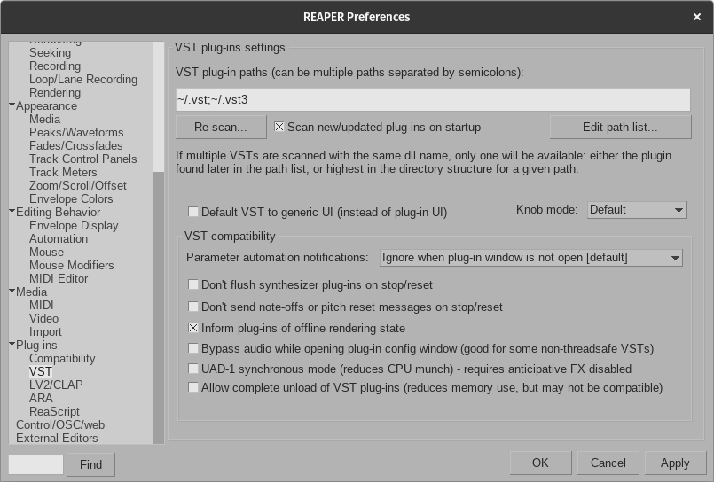
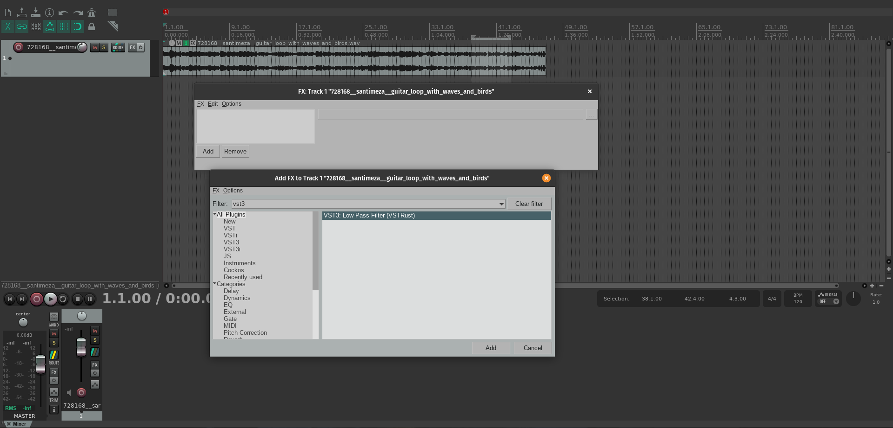
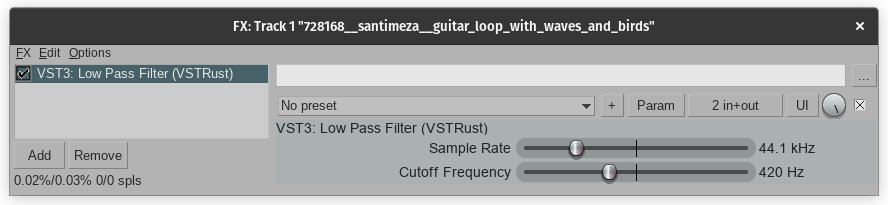

# vst-exploration

## Rust setup

Install Rust by following the [Rust Getting Started Guide](https://www.rust-lang.org/learn/get-started).

## Installing OS dependencies

### Ubuntu/PopOS

- Supports X11 windows manager.

```bash
sudo apt update
# VST3 Plugin dependencies
sudo apt-get install -y libasound2-dev libgl-dev libjack-dev libx11-xcb-dev libxcb1-dev libxcb-dri2-0-dev libxcb-icccm4-dev libxcursor-dev
# Screen Capture dependencies
sudo apt-get install -y libxcb1 libxrandr2 libdbus-1-3
```

## Building & Running

- Clone the project.

```bash
git clone https://github.com/lantoniogc/vst-exploration.git
```

- Change directory into the project folder.

```bash
cd vst-exploration/
```

### Low Pass Filter Plugin

- Check the implementation explanation [HERE](https://dobrian.github.io/cmp/topics/filters/lowpassfilter.html) on `Adjustable Lowpass Filter`.

```
yn = axn+(1-a))xn-1
```

- Build the VST3 and CLAP plugin.

```bash
cargo xtask bundle low_pass_filter_plugin --release
```

#### Running with [Reaper](https://www.reaper.fm/)

Using Reaper v7.1.1

##### Settings



- Open Reaper and go to `Options > Preferences > Plugin-ins > VST`.

- Click on `Edit path list...` and add the path to your plugin folder or use the known paths by Reaper (`~/.vst` or `~/.vst3`).

- After adding the plugin folder path go to `Re-scan...` and click on `Clear cache and re-scan VST paths for all plugins`.

##### Using the VST3 plugin.



- Add a track into Reaper and press the FX button: [Track shown on image](https://freesound.org/people/santimeza/sounds/728168/)

- Press on the `Add` button to look for the plugin.

- Search for VST3 and you should see the `VST3: Low Pass Filter (VSTRust)`. Click on `Add` and start using the plugin!



### Screen Capture

- Build and run the application.

```bash
cargo run -p screen_capture --release
```

- The application will take a screen capture as soon is ready to run. `screenshot.png` will be available at the project root.
